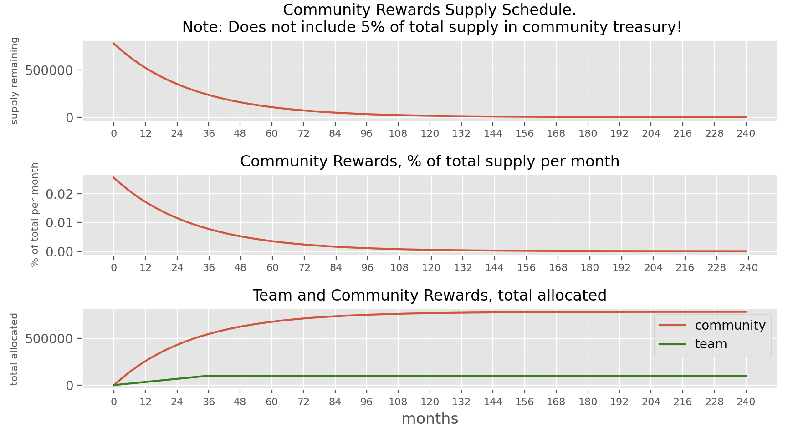

# Rewards

78% of the RATE supply will be distributed to community through rewards. Rewards can be received by&#x20;

*   **Providing TAI/ETH Liquidity in the TAI App**

    or
*   **Minting TAI from any Safe**


Users can receive both mint and liquidity rewards at the same time.

**Community Rewards Allocation**

Current allocations:

| Rewards           | Allocation of emitted rewards |
| ----------------- | ----------------------------- |
| TAI/ETH Liquidity | 90%                           |
| MInt TAI          | 10%                           |

The RATE amount distributed to LPers vs Minters will not remain constant and will be periodically re-evaluated.

**Community Rewards Emission Schedule**

RATE rewards emission is done on a hardcoded schedule from the [Emitter contract](https://etherscan.io/address/0xa1275172bd1ce03781a633a5c492d5b72c8cd870).

Below is the reward schedule encoded in the contract, along with Team rewards vesting for comparison

<figure><figcaption><p>Total Rewards Schedule</p></figcaption></figure>

The RATE rewards schedule is generated from this supply function.

```
import math
start = 780000 # 78%
c = 20
lam = 1/120

def starting_supply(month):
    # amount at begining of `month` month after launch
    return start * (c*math.e)**(lam * -month)
```

Using this supply function:

| Time     | % of rewards that have been distributed |
| -------- | --------------------------------------- |
| 1 year   | 32.94%                                  |
| 5 years  | 86.44%                                  |
| 10 years | 98.16%                                  |
| 20 years | 99.97%                                  |

